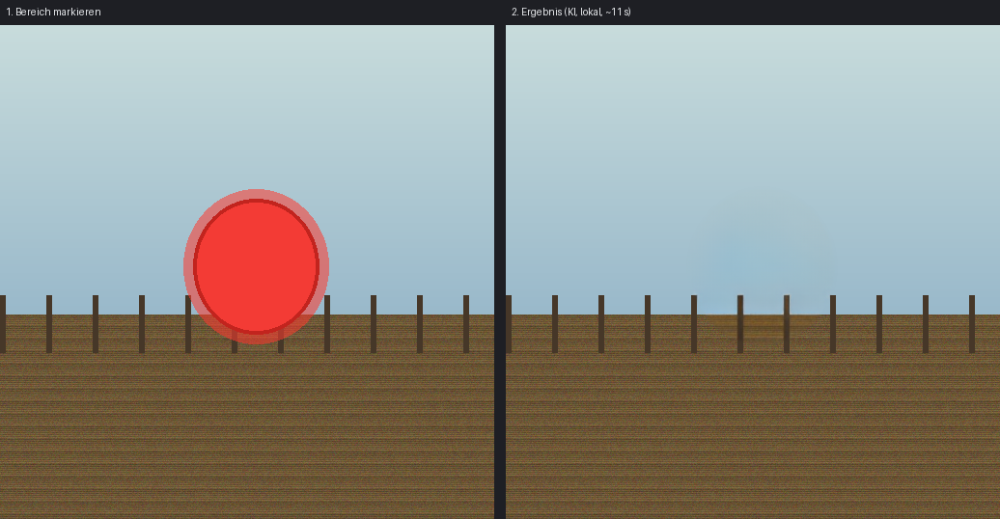
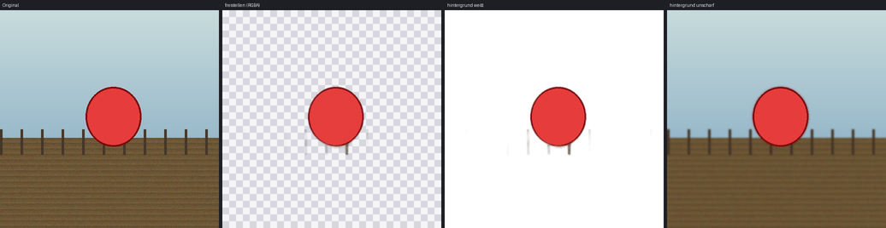

# Installation ohne Internet auf einem 32-Bit-Windows-Laptop

Diese Anleitung ist für den Fall, dass **nur ein 32-Bit-Windows-Rechner** zur
Verfügung steht und dieser **keine Internetverbindung** hat. Die Bildbearbeitung
läuft dann vollständig auf diesem Gerät – ohne Server, ohne Netz, ohne
laufende Kosten.

---

## Was auf diesem Rechner möglich ist – und was nicht

| | |
|---|---|
| ✅ **Bereich mit KI ersetzen** | Ein neuronales Netz (LaMa, 51 Mio. Parameter) rechnet den markierten Bereich weg und setzt die Umgebung fort. Objekte entfernen, Personen retuschieren, Störer wegnehmen. |
| ✅ **Motiv freistellen (KI)** | Ein zweites Netz (U²-Net, 1,1 Mio. Parameter) erkennt das Hauptmotiv von selbst – ohne Pinsel. Hintergrund transparent, einfarbig oder weichgezeichnet. |
| ✅ **Bild-zu-Bild-Anpassungen** | Helligkeit, Kontrast, Farbe, Schärfe, Weichzeichnen – per Texteingabe gesteuert, sofort. |
| ✅ **Vollständige Oberfläche** | Maske malen, Radierer, Zoom, Verlauf, Vergleich, Speichern. |
| ❌ **Z-Image selbst** | Braucht ~12 GB Speicher und PyTorch; für 32-Bit technisch unmöglich (Details in [WINDOWS32.md](WINDOWS32.md)). Die Unterstützung bleibt im Programm für den Fall, dass später ein passender Rechner da ist. |
| ❌ **Bild aus reinem Text erzeugen** | Setzt ein Modell voraus, das auf diesem Gerät nicht läuft. |

Kurz: **Bearbeiten ja, aus dem Nichts erfinden nein.**





---

## Schritt 1 – Auf einem Rechner *mit* Internet vorbereiten

Irgendein PC, Bibliothek, Internetcafé oder Handy-Hotspot genügt; das muss nur
ein einziges Mal geschehen.

```bat
python tools\build_offline_bundle.py --out ZImageStudio-Offline
```

Das Skript sammelt:

* `app\` – das Programm,
* `wheels\` – NumPy 1.24.4 für 32-Bit-Windows (für Python 3.8 bis 3.11),
* `models\lama_fp32.onnx` – das KI-Modell (204 MB, Lizenz Apache-2.0),
* `LIESMICH.txt` – die Kurzfassung dieser Anleitung.

Ohne das Skript geht es auch von Hand:

| Datei | Quelle |
|---|---|
| Python 3.11 **32-Bit** | python.org → Downloads → „Windows installer (32-bit)" |
| `numpy‑1.24.4‑cp311‑cp311‑win32.whl` | pypi.org/project/numpy/1.24.4/#files |
| `lama_fp32.onnx` (204 MB) | huggingface.co/Carve/LaMa-ONNX → `lama_fp32.onnx` |
| `u2netp.onnx` (5 MB) | github.com/danielgatis/rembg → Releases → `u2netp.onnx` |

Prüfsummen (SHA-256):
`1faef5301d78db7dda502fe59966957ec4b79dd64e16f03ed96913c7a4eb68d6`  (lama_fp32.onnx)
`309c8469258dda742793dce0ebea8e6dd393174f89934733ecc8b14c76f4ddd8`  (u2netp.onnx)

Alles zusammen auf einen USB-Stick. Benötigt werden etwa **300 MB**.

---

## Schritt 2 – Auf dem Laptop installieren

1. **Python installieren.** Den 32-Bit-Installer ausführen.
   Wichtig: **„tcl/tk and IDLE"** angehakt lassen (das ist die Oberfläche) und
   **„Add python.exe to PATH"** aktivieren.

2. **Ordner kopieren**, zum Beispiel nach `C:\ZImageStudio`.

3. **NumPy installieren** – Eingabeaufforderung im Ordner öffnen:

   ```bat
   py -3-32 -m pip install --no-index --find-links wheels numpy
   ```

   Ohne Internet klappt das, weil das Paket auf dem Stick liegt.

4. **Prüfen, ob alles passt:**

   ```bat
   py -3-32 app\tools\check_system.py
   ```

   Das Skript sagt für jeden Punkt, ob er in Ordnung ist, und schätzt, wie
   lange eine KI-Bearbeitung auf diesem Rechner dauert.

5. **Starten:**

   ```bat
   cd app
   py -3-32 -m zimage_studio.client
   ```

   Oder per Doppelklick auf `app\tools\start_client.bat`.

6. **Modell einmalig zuordnen:** im Programm
   *Verarbeitung → KI-Modelldatei wählen…* und `models\lama_fp32.onnx`
   auswählen. Die Einstellung bleibt gespeichert.
   (Alternativ die Datei nach `app\models\` legen – dann wird sie automatisch
   gefunden.)

---

## Schritt 3 – Arbeiten

### Motiv freistellen (ohne Pinsel)

1. **Öffnen** (Strg+O).
2. Ins Textfeld `freistellen` schreiben – oder `hintergrund weiß`,
   `hintergrund unscharf`.
3. **Generieren**. Das Netz erkennt das auffälligste Objekt selbst.

Das Freistell-Netz erkennt *das* Hauptmotiv, nicht „die Person links". Sind
mehrere Objekte im Bild, ist der Pinsel der zuverlässigere Weg.

### Etwas aus einem Foto entfernen

1. **Öffnen** (Strg+O).
2. Mit dem **Pinsel** großzügig über das Objekt malen – lieber etwas mehr als
   zu wenig; der Rand des Objekts muss mit unter die Maske.
3. Ins Textfeld `entfernen` schreiben (oder es leer lassen – bei markierter
   Fläche ist Entfernen die Voreinstellung).
4. **Generieren** (Strg+Eingabe). Der Fortschritt läuft mit, **Abbrechen** geht
   jederzeit.
5. Mit **Vergleich** vorher/nachher umschalten, dann **Strg+S** zum Speichern.

### Bild anpassen

Textfeld nutzen, Beispiele:

| Eingabe | Wirkung |
|---|---|
| `etwas heller` | Helligkeit leicht anheben |
| `mehr kontrast` | Kontrast anheben |
| `schwarzweiß` | Graustufen |
| `sepia` | Warmer Braunton |
| `wärmer` / `kühler` | Farbstimmung |
| `weichzeichnen` / `schärfen` | Detailgrad |
| `entrauschen` | Bildrauschen glätten |
| `füll das mit schwarz` | Fläche einfärben |
| `entferne den fleck und mach es heller` | Mehrere Schritte auf einmal |
| `freistellen` | Motiv erkennen, Hintergrund transparent (PNG mit Alpha) |
| `hintergrund entfernen` | dasselbe |
| `hintergrund weiß` | Hintergrund einfarbig ersetzen |
| `hintergrund unscharf` | Hintergrund weichzeichnen, Motiv bleibt scharf |

Stärkewörter: `leicht`, `etwas`, `stark`, `sehr`. Zusätzlich wirkt der Regler
**Stärke**. Ist ein Bereich markiert, gilt die Anpassung nur dort – sonst für
das ganze Bild.

Die vollständige Liste zeigt das Programm unter *Hilfe → Befehle des lokalen
Modus*.

---

## Wie lange dauert eine KI-Bearbeitung?

Das hängt ganz am Prozessor. Auf dem Entwicklungsrechner dauert eine Bearbeitung
11 Sekunden. Auf einem alten 32-Bit-Laptop sind **einige Minuten** realistisch,
auf sehr alter Hardware auch mehr. `check_system.py` gibt eine Schätzung für
genau Ihr Gerät aus.

Die Bearbeitung läuft im Hintergrund: die Oberfläche bleibt bedienbar und der
Auftrag lässt sich abbrechen.

Anpassungen wie Helligkeit oder Schwarzweiß brauchen dagegen nur Sekunden-
bruchteile – dafür wird kein neuronales Netz verwendet.

---

## Wenn etwas nicht funktioniert

**„Tkinter fehlt"** – Python-Installer erneut ausführen, *Modify* wählen,
„tcl/tk and IDLE" aktivieren.

**„NumPy fehlt" / Entfernen sieht verwaschen aus** – dann rechnet die einfache
Flächenfüllung statt des Netzes. NumPy wie in Schritt 3 installieren und
prüfen, dass in der Kopfzeile rechts *„Lokal: LaMa (51M)"* steht (grüner Punkt).

**„Zu wenig Arbeitsspeicher"** – andere Programme schließen. Das Netz braucht
etwa 500 MB. Ein kleiner markierter Bereich ändert daran nichts, weil immer ein
512×512-Ausschnitt gerechnet wird.

**Falsche Python-Version** – `py -3-32 -V` muss 3.8 bis 3.11 anzeigen. Für
Python 3.12 und neuer gibt es kein 32-Bit-NumPy mehr.

**JPEG lässt sich nicht öffnen** – ohne Server kann der Client nur PNG, GIF und
BMP lesen. Die Datei vorher (z. B. in Paint) als PNG speichern. Wer Pillow
installieren kann, öffnet damit auch JPEG und WebP:
`py -3-32 -m pip install --no-index --find-links wheels pillow` (das Wheel dann
ebenfalls mit auf den Stick nehmen).
