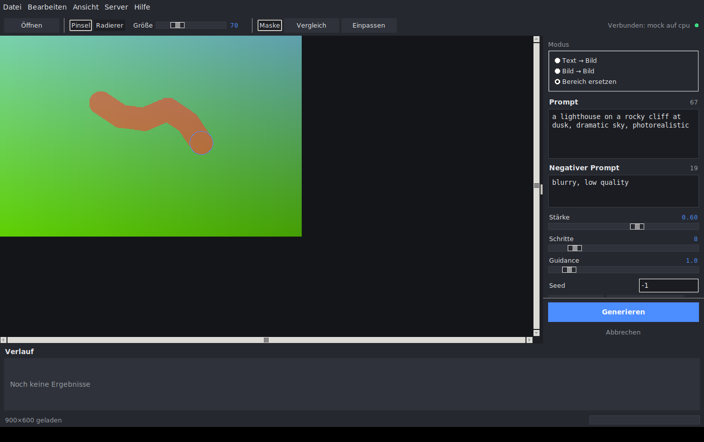

# Z-Image Studio auf 32-Bit-Windows

Diese Anleitung beschreibt die mitgelieferte Bild-zu-Bild-Anwendung: eine
Desktop-Oberfläche mit Pinsel-Maske und Prompt-Eingabe, die auch auf einem
32-Bit-Windows läuft, plus den Server, der die Z-Image-Gewichte rechnet.



---

## 1. Warum zwei Programme?

Z-Image ist ein 6-Milliarden-Parameter-Modell. In `bfloat16` belegen allein die
Gewichte rund 12 GB.

Ein 32-Bit-Windows-Prozess kann höchstens 2 GB (mit `/LARGEADDRESSAWARE` 3–4 GB)
adressieren, und **PyTorch veröffentlicht keine 32-Bit-Windows-Pakete**
(`pip install torch` findet dort kein passendes Wheel). Eine Software, die
behauptet, das Modell lokal auf 32-Bit zu rechnen, kann nicht funktionieren.

Deshalb ist die Anwendung geteilt:

| Teil | Läuft auf | Braucht |
|------|-----------|---------|
| **Client** (`zimage_studio.client`) – Fenster, Zoom, Masken-Pinsel, Prompt, Verlauf | 32-Bit-Windows ab Windows 7, 64-Bit, Linux, macOS | nur Python-Standardbibliothek inkl. Tkinter |
| **Server** (`zimage_studio.server`) – Modell, Sampling | 64-Bit-Rechner mit GPU (CUDA), Apple Silicon oder CPU | Python ≥ 3.10, PyTorch, Pillow |

Beide reden über eine schlanke HTTP-/JSON-Schnittstelle. Der Server darf
derselbe Rechner (falls 64-Bit), ein anderer PC im Netz oder eine gemietete
GPU-Maschine sein.

Der Client kommt bewusst **ohne Pillow, NumPy oder Requests** aus: PNG-Kodierung,
Formaterkennung und das Rastern der Pinselmaske sind in reinem Python
implementiert (`zimage_studio/imaging.py`). Damit gibt es auf 32-Bit-Windows
keine Wheel-Probleme.

---

## 2. Client installieren (32-Bit-Windows)

1. **Python 32-Bit installieren.** Auf python.org unter *Windows installer
   (32-bit)* herunterladen (Python 3.8 – 3.13). Im Installer
   **„tcl/tk and IDLE"** aktiviert lassen – daraus kommt die Oberfläche.
2. Dieses Repository entpacken oder klonen.
3. Doppelklick auf `tools\start_client.bat` –
   oder in der Eingabeaufforderung:

   ```bat
   py -3-32 -m zimage_studio.client
   ```

Es wird **nichts** per `pip` nachinstalliert.

### Ohne Server ausprobieren

```bat
tools\start_demo.bat
```

startet ein eingebautes Demo-Backend im selben Prozess. Es erzeugt prozedurale
Bilder statt Modellausgaben, aber sämtliche Bedienschritte – Bild laden, Maske
malen, Generieren, Abbrechen, Verlauf, Speichern – funktionieren damit
vollständig und ohne GPU.

### Eine EXE bauen

```bat
py -3-32 -m pip install pyinstaller
py -3-32 -m PyInstaller tools\zimage_studio_client.spec
```

Ergebnis: `dist\ZImageStudio.exe`, eine 32-Bit-Anwendung ohne weitere
Abhängigkeiten.

---

## 3. Server einrichten (64-Bit-Rechner mit GPU)

```bash
python -m pip install torch --index-url https://download.pytorch.org/whl/cu124
python -m pip install -r requirements.txt   # bzw. pip install -e .
python -m zimage_studio.server --host 0.0.0.0 --port 8787
```

Beim ersten Start lädt der Server die Gewichte nach `ckpts/Z-Image-Turbo`
(ca. 12 GB). Wichtige Schalter:

| Option | Bedeutung |
|--------|-----------|
| `--host 0.0.0.0` | im lokalen Netz erreichbar (sonst nur `127.0.0.1`) |
| `--port 8787` | TCP-Port |
| `--model-path PFAD` | anderer Gewichte-Ordner |
| `--device cuda\|mps\|cpu` | Gerät erzwingen (Standard: automatisch) |
| `--dtype bfloat16\|float16\|float32` | Rechengenauigkeit |
| `--token GEHEIM` | Zugriffsschutz; im Client unter *Server → Verbindung* eintragen |
| `--preload` | Gewichte sofort laden statt beim ersten Auftrag |
| `--engine mock` | Demo-Engine ohne Modell (zum Testen der Verbindung) |

> **Hinweis zur Sicherheit:** Ohne `--token` kann jeder, der den Port erreicht,
> die GPU benutzen. Im offenen Netz immer ein Token setzen.

Im Client dann *Server → Verbindung…* öffnen und
`http://<IP-des-Servers>:8787` eintragen. Der Punkt oben rechts wird grün,
sobald die Verbindung steht.

---

## 4. Bedienung

### Bild-zu-Bild

1. **Öffnen** (Strg+O) – PNG, JPEG, WebP, BMP, GIF, TIFF.
   Formate, die Tkinter nicht kennt, wandelt der Server automatisch um.
2. Prompt eingeben.
3. **Stärke** bestimmt, wie weit sich das Ergebnis vom Original entfernt:
   0,2 = behutsame Überarbeitung, 0,8 = weitgehende Neuinterpretation.
4. **Generieren** (Strg+Eingabe).

### Bereich ersetzen (Inpainting)

1. Bild öffnen.
2. Mit dem **Pinsel** über den Bereich malen, der ersetzt werden soll – der
   Modus schaltet automatisch auf *Bereich ersetzen*.
   Der **Radierer** nimmt Teile der Maske zurück, Strg+Z macht Striche
   rückgängig.
3. Prompt beschreibt, was dort entstehen soll.
4. *Kantenweichzeichnung* macht den Übergang weich; *Unmaskierte Pixel exakt
   behalten* garantiert, dass außerhalb der Maske kein einziges Pixel abweicht.

### Weitere Bedienelemente

* **Vergleich** blendet zwischen Ergebnis und Original um.
* Der **Verlauf** unten zeigt alle Ergebnisse; Doppelklick übernimmt eines als
  neues Ausgangsbild (iteratives Arbeiten).
* **Seed** festhalten reproduziert ein Ergebnis exakt; *Zufall* würfelt neu.
* Sprache (Deutsch/English) und helles/dunkles Design unter *Ansicht*.

### Tastenkürzel

| Taste | Funktion |
|-------|----------|
| Strg+O / Strg+S | Öffnen / Ergebnis speichern |
| Strg+Z / Strg+Y | Rückgängig / Wiederholen |
| Strg+Eingabe | Generieren |
| Esc | Abbrechen |
| B / E | Pinsel / Radierer |
| `[` / `]` | Pinsel kleiner / größer |
| `+` / `-` / `0` | Zoom rein / raus / einpassen |
| M | Maske ein- und ausblenden |
| Leertaste + Ziehen | Bild verschieben |

---

## 5. Fehlersuche

**„Nicht verbunden"** – Läuft der Server? Stimmen IP und Port? Bei einem anderen
Rechner muss der Port in der Windows-Firewall freigegeben sein
(`netsh advfirewall firewall add rule name="Z-Image" dir=in action=allow protocol=TCP localport=8787`).

**„Dieses Format kann ohne Serververbindung nicht gelesen werden"** – JPEG und
WebP kann der Client alleine nicht dekodieren. Erst verbinden, dann öffnen –
oder die Datei vorher als PNG speichern.

**Tkinter fehlt** – Python-Installer erneut ausführen, *Modify* wählen und
„tcl/tk and IDLE" aktivieren.

**Der Server meldet zu wenig Speicher** – kleinere Ausgabegröße wählen (0,5 MP)
oder `--dtype float16` verwenden.

**Sehr großes Bild geöffnet** – Der Client verkleinert Quellbilder auf maximal
2048 px Kantenlänge, damit ein 32-Bit-Prozess nicht an die Adressgrenze stößt.
